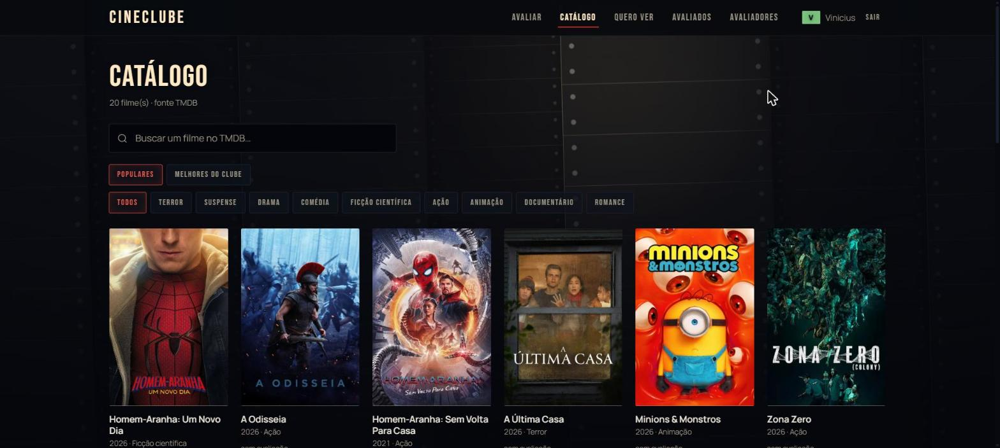
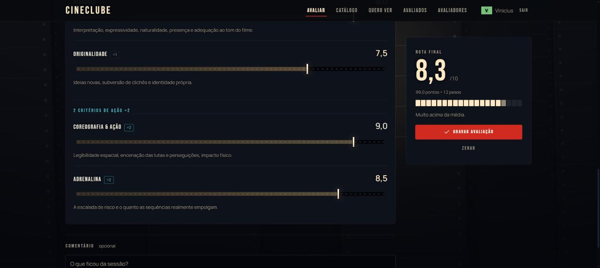
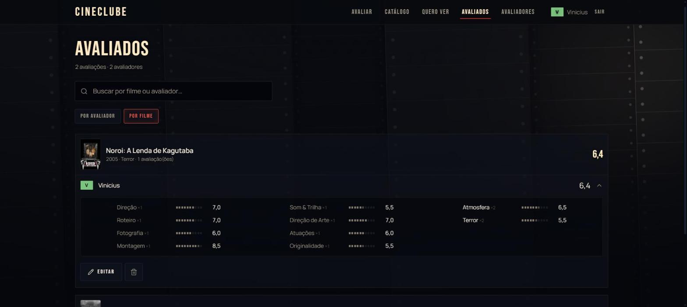
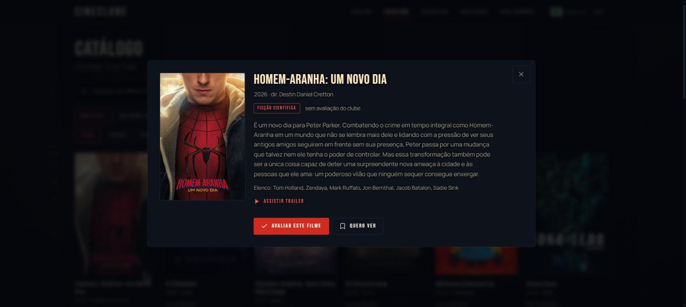
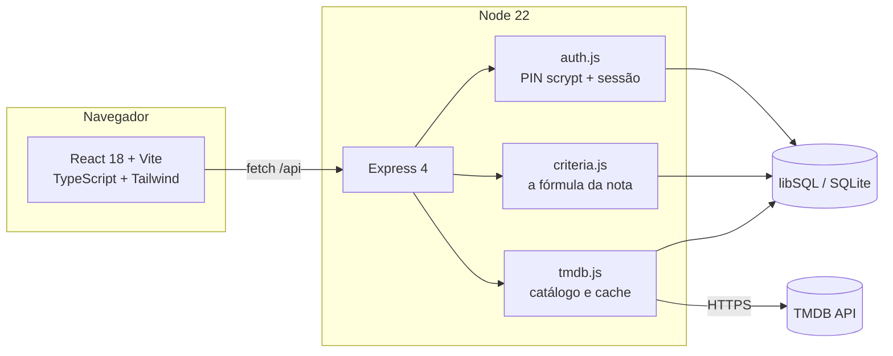

<div align="center">

# CINECLUBE


Dez critérios, dois deles pesando o dobro conforme o gênero, e o resultado
guardado como registro do grupo. Não é um app de estrelinhas: é uma sala de
projeção onde cada pessoa defende o que achou, com o número aberto embaixo.

<br>


<br>



<sub>A parede atrás de tudo é uma parede de filme. Ela acende onde o cursor passa.</sub>

</div>

---

## O que é

Um grupo de amigos assiste a um filme junto e depois discorda sobre ele. O
Cineclube é o lugar onde essa discordância vira registro: cada pessoa dá dez
notas, o app calcula uma só, e o histórico do clube mostra quem achou o quê —
lado a lado, sem média escondendo divergência.

O catálogo vem do **TMDB**, então qualquer filme já lançado está a uma busca de
distância. Filmes marcados como "quero ver" viram uma fila reordenável, e gravar
uma avaliação tira o filme dela automaticamente.

É um projeto pessoal, fechado por PIN, feito para um grupo específico. Não há
cadastro aberto e não há URL pública neste repositório — o código está aqui como
portfólio, o clube não.

---

## A nota

O ponto do projeto. Uma estrela não diz nada sobre *por que* um filme é bom, e
uma média de estrelas diz menos ainda. Aqui a nota é uma soma ponderada de
critérios nomeados, e o cálculo fica visível na tela enquanto você mexe nele.

<div align="center">

</div>

**Oito critérios técnicos**, iguais para todo filme, com peso **×1**:

| | | | |
|---|---|---|---|
| Direção | Roteiro | Fotografia | Montagem |
| Som & Trilha | Direção de Arte | Atuações | Originalidade |

**Dois critérios do gênero**, com peso **×2** — porque o que faz um terror bom
não é o que faz uma comédia boa:

<details>
<summary><b>Os nove gêneros e seus critérios</b></summary>

<br>

| Gênero | Critérios ×2 |
|---|---|
| **Terror** | Atmosfera · Terror |
| **Suspense** | Atmosfera · Tensão |
| **Drama** | Densidade dramática · Impacto emocional |
| **Comédia** | Ritmo cômico · Humor |
| **Ficção científica** | Construção de mundo · Ideia central |
| **Ação** | Coreografia & ação · Adrenalina |
| **Animação** | Expressividade visual · Encanto |
| **Documentário** | Construção do argumento · Relevância |
| **Romance** | Química · Impacto emocional |

O gênero vem do TMDB e cai em Drama quando não reconhecido — a fórmula nunca
fica sem os dez critérios.

</details>

<br>

A conta é a soma dos pontos dividida por **12 pesos** (8×1 + 2×2), o que devolve
a nota à escala de 0 a 10:

```
nota = (Σ critério × peso) ÷ 12
```

O servidor é dono dessa fórmula (`criteria.js`). O cliente a repete apenas para
que o número responda à mão sem esperar a rede — ele nunca decide o valor, só
antecipa.

---

## O registro

O que o clube volta para consultar. Por filme, com todo mundo junto; ou por
pessoa, para ver o que cada um andou assistindo. Abrir uma avaliação mostra os
dez números que produziram a nota.

<div align="center">

</div>

Uma avaliação pertence a quem a deu, e a mais ninguém — nem ao administrador. A
sessão assina o registro no servidor, então não existe requisição que edite a
nota de outra pessoa. Apagar uma avaliação não é moderação, é desdizer uma
opinião, e isso só cabe a quem a disse.

---

## O desenho

A premissa: **as notas de um clube de cinema são lidas do jeito que um filme é
lido — como luz atravessando celuloide numa sala escura.**

<div align="center">

</div>

Disso sai tudo o resto:

- **A sala.** Azul-preto de auditório com as luzes baixas. A parede ao fundo é
  uma parede de celuloide de verdade — tiras de 35 mm em quatro planos de
  profundidade, com furos de arrasto, linhas de quadro e sombras que caem umas
  sobre as outras. Ela corre devagar e acende onde o cursor está.
- **A cor.** Tricromia Technicolor — vermelho, ciano e o creme do facho — e
  nada mais. Nenhum acento neon sobre cinza: a cor vem do meio, não da moda.
- **A tipografia.** Staatliches faz o papel de cartela de título: capitulares
  condensadas com o peso e os cantos duros de um cartaz serigrafado. Poppins,
  geométrica e redonda, carrega todo o resto — o contraste entre as duas é o que
  separa o que o filme anuncia do que o clube escreveu sobre ele.
- **Os controles.** Cada critério é uma tira de filme correndo por um projetor,
  e a marca é a janela onde o quadro é lido. Por baixo continua sendo um
  `<input type="range">` nativo — o teclado, o leitor de tela e o passo de 0,5
  seguem funcionando. O estilo nunca substitui o controle.
- **A legibilidade.** Quase todo texto do produto fica direto sobre a parede, e a
  parede acende. Cada glifo carrega uma sombra da cor da própria sala: invisível
  contra o escuro, e uma borda dura de volta em torno das letras exatamente onde
  o facho passa por trás delas.

---

## Arquitetura



O cliente é compilado **na máquina** e o resultado vai versionado em `public/`.
É uma decisão de custo: a instância gratuita onde isso roda tem 512 MB, e
compilar ~2000 módulos do Vite lá é moeda ao alto contra esse teto. Compilando
aqui, publicar vira só um `npm ci`.

```
app/
├─ server.js         Express, boot, estáticos com cache de um ano em /assets
├─ db.js             libSQL: esquema, migrações e prepared statements
├─ auth.js           PIN com scrypt, sessões de 24 h em cookie httpOnly
├─ criteria.js       os dez critérios, os pesos e a fórmula
├─ tmdb.js           cliente do TMDB, com cache dos filmes já vistos
├─ wrap.js           handler async → next(err), que o Express 4 não faz sozinho
├─ routes/           auth · catalog · reviewers · reviews · watchlist
├─ test/             63 testes em node:test, banco descartável
├─ client/
│  └─ src/
│     ├─ App.tsx     estado do clube, contexto, a marquise
│     ├─ screens/    Avaliar · Catálogo · Quero ver · Avaliados · Avaliadores
│     ├─ components/ film.tsx (célula e ficha) · bits.tsx (o vocabulário) · ui/
│     └─ index.css   o sistema de design, em CSS
└─ public/           o cliente compilado — versionado de propósito
```

### Segurança

- O PIN **nunca** é guardado, registrado ou devolvido. O banco tem apenas um
  hash `scrypt` e o sal; a comparação é `timingSafeEqual`.
- O cookie de sessão carrega um token aleatório de 32 bytes; o banco guarda só
  o hash dele. `httpOnly`, `sameSite`, e `Secure` atrás de HTTPS.
- Quem está na sessão é quem assina a avaliação — o cliente não escolhe autor.
- Nenhum segredo no repositório: `.env` está no `.gitignore` e o app se recusa a
  inventar um PIN inicial em produção.

---

## Instalação

Precisa de **Node 22.5+** e de um *API Read Access Token* (v4) do
[TMDB](https://www.themoviedb.org/settings/api) — gratuito.

```bash
git clone https://github.com/ViniciusHrzr/Cineclube.git
cd Cineclube
npm install

cp .env.example .env      # e cole seu TMDB_TOKEN
npm run build             # instala e compila o cliente para public/
npm start                 # http://localhost:3000
```

Sem `TURSO_DATABASE_URL` no ambiente, o app abre um arquivo SQLite local em
`data/` e cria o esquema sozinho. Não precisa de conta em nuvem nenhuma para
desenvolver.

Durante o desenvolvimento do cliente, o Vite serve a interface e encaminha
`/api` para o Express:

```bash
npm start                      # terminal 1 — a API na 3000
npm --prefix client run dev    # terminal 2 — a interface na 5173
```

### Testes

```bash
npm test
```

63 testes em `node:test`, sem dependência de teste alguma. Cada um roda contra
um banco descartável, e a suíte cobre a fórmula da nota em todos os gêneros, a
taxonomia do TMDB nos dois sentidos, o ciclo de sessão e as regras de quem pode
escrever o quê.

---

## Stack

| Camada | |
|---|---|
| **Interface** | React 18 · TypeScript · Vite 6 · Tailwind CSS 3 · Framer Motion · Lucide |
| **Servidor** | Node 22 · Express 4 |
| **Dados** | libSQL (SQLite) — arquivo local em dev, gerenciado em produção |
| **Externo** | TMDB API |
| **Testes** | `node:test` |

Sem framework de teste, sem ORM, sem biblioteca de estado. Cada dependência aqui
está porque foi usada.

---

<div align="center">

<sub>
Este produto usa a API do <b>TMDB</b>, mas não é endossado nem certificado pelo TMDB.
</sub>

<br><br>

<sub>Projeto pessoal · <b>Vinicius</b> · o clube é fechado, o código é aberto</sub>

</div>
