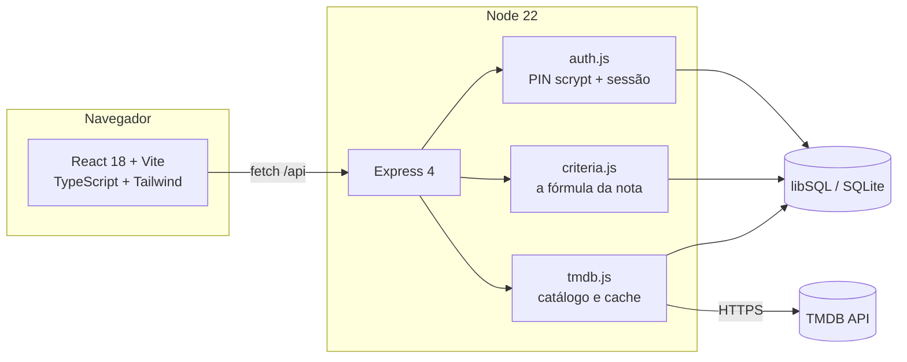

<div align="center">

# CINECLUBE


Dez critérios, dois deles pesando o dobro conforme o gênero, e o resultado
guardado como registro do grupo. Não é um app de estrelinhas: é uma sala de
projeção onde cada pessoa defende o que achou, com o número aberto embaixo.

<br>


<br>


<sub>A parede atrás de tudo é uma parede de filme. Ela acende onde o cursor passa.</sub>

</div>

---

## O que é

Um grupo de amigos assiste a um filme junto e depois discorda sobre ele. O
Cineclube é o lugar onde essa discordância vira registro: cada pessoa dá dez
notas, o app calcula uma só, e o histórico do clube mostra quem achou o quê —
lado a lado, sem média escondendo divergência.

O catálogo vem do **TMDB**, então qualquer filme já lançado está a uma busca de
distância. Filmes marcados como "quero ver" viram uma fila reordenável, e gravar
uma avaliação tira o filme dela automaticamente.

É um projeto pessoal, fechado por PIN, feito para um grupo específico. Não há
cadastro aberto e não há URL pública neste repositório — o código está aqui como
portfólio, o clube não.

---

## A nota

O ponto do projeto. Uma estrela não diz nada sobre *por que* um filme é bom, e
uma média de estrelas diz menos ainda. Aqui a nota é uma soma ponderada de
critérios nomeados, e o cálculo fica visível na tela enquanto você mexe nele.

<div align="center">

</div>

**Oito critérios técnicos**, iguais para todo filme, com peso **×1**:

| | | | |
|---|---|---|---|
| Direção | Roteiro | Fotografia | Montagem |
| Som & Trilha | Direção de Arte | Atuações | Originalidade |

**Dois critérios do gênero**, com peso **×2** — porque o que faz um terror bom
não é o que faz uma comédia boa:

<details>
<summary><b>Os nove gêneros e seus critérios</b></summary>

<br>

| Gênero | Critérios ×2 |
|---|---|
| **Terror** | Atmosfera · Terror |
| **Suspense** | Atmosfera · Tensão |
| **Drama** | Densidade dramática · Impacto emocional |
| **Comédia** | Ritmo cômico · Humor |
| **Ficção científica** | Construção de mundo · Ideia central |
| **Ação** | Coreografia & ação · Adrenalina |
| **Animação** | Expressividade visual · Encanto |
| **Documentário** | Construção do argumento · Relevância |
| **Romance** | Química · Impacto emocional |

O gênero vem do TMDB e cai em Drama quando não reconhecido — a fórmula nunca
fica sem os dez critérios.

</details>

<br>

A conta é a soma dos pontos dividida por **12 pesos** (8×1 + 2×2), o que devolve
a nota à escala de 0 a 10:

```
nota = (Σ critério × peso) ÷ 12
```

O servidor é dono dessa fórmula (`criteria.js`). O cliente a repete apenas para
que o número responda à mão sem esperar a rede — ele nunca decide o valor, só
antecipa.

---

## O registro

O que o clube volta para consultar. Por filme, com todo mundo junto; ou por
pessoa, para ver o que cada um andou assistindo. Abrir uma avaliação mostra os
dez números que produziram a nota.

<div align="center">

</div>

Uma avaliação pertence a quem a deu, e a mais ninguém — nem ao administrador. A
sessão assina o registro no servidor, então não existe requisição que edite a
nota de outra pessoa. Apagar uma avaliação não é moderação, é desdizer uma
opinião, e isso só cabe a quem a disse.

---

## O desenho

A premissa: **as notas de um clube de cinema são lidas do jeito que um filme é
lido — como luz atravessando celuloide numa sala escura.**

<div align="center">

</div>

Disso sai tudo o resto:

- **A sala.** Azul-preto de auditório com as luzes baixas. A parede ao fundo é
  uma parede de celuloide de verdade — tiras de 35 mm em quatro planos de
  profundidade, com furos de arrasto, linhas de quadro e sombras que caem umas
  sobre as outras. Ela corre devagar e acende onde o cursor está.
- **A cor.** Tricromia Technicolor — vermelho, ciano e o creme do facho — e
  nada mais. Nenhum acento neon sobre cinza: a cor vem do meio, não da moda.
- **A tipografia.** Staatliches faz o papel de cartela de título: capitulares
  condensadas com o peso e os cantos duros de um cartaz serigrafado. Poppins,
  geométrica e redonda, carrega todo o resto — o contraste entre as duas é o que
  separa o que o filme anuncia do que o clube escreveu sobre ele.
- **Os controles.** Cada critério é uma tira de filme correndo por um projetor,
  e a marca é a janela onde o quadro é lido. Por baixo continua sendo um
  `<input type="range">` nativo — o teclado, o leitor de tela e o passo de 0,5
  seguem funcionando. O estilo nunca substitui o controle.
- **A legibilidade.** Quase todo texto do produto fica direto sobre a parede, e a
  parede acende. Cada glifo carrega uma sombra da cor da própria sala: invisível
  contra o escuro, e uma borda dura de volta em torno das letras exatamente onde
  o facho passa por trás delas.

---

## Arquitetura



O cliente é compilado **na máquina** e o resultado vai versionado em `public/`.
É uma decisão de custo: a instância gratuita onde isso roda tem 512 MB, e
compilar ~2000 módulos do Vite lá é moeda ao alto contra esse teto. Compilando
aqui, publicar vira só um `npm ci`.

```
app/
├─ server.js         Express, boot, estáticos com cache de um ano em /assets
├─ db.js             libSQL: esquema, migrações e prepared statements
├─ auth.js           PIN com scrypt, sessões de 24 h em cookie httpOnly
├─ criteria.js       os dez critérios, os pesos e a fórmula
├─ tmdb.js           cliente do TMDB, com cache dos filmes já vistos
├─ wrap.js           handler async → next(err), que o Express 4 não faz sozinho
├─ routes/           auth · catalog · reviewers · reviews · watchlist
├─ test/             63 testes em node:test, banco descartável
├─ client/
│  └─ src/
│     ├─ App.tsx     estado do clube, contexto, a marquise
│     ├─ screens/    Avaliar · Catálogo · Quero ver · Avaliados · Avaliadores
│     ├─ components/ film.tsx (célula e ficha) · bits.tsx (o vocabulário) · ui/
│     └─ index.css   o sistema de design, em CSS
└─ public/           o cliente compilado — versionado de propósito
```

### Segurança

- O PIN **nunca** é guardado, registrado ou devolvido. O banco tem apenas um
  hash `scrypt` e o sal; a comparação é `timingSafeEqual`.
- O cookie de sessão carrega um token aleatório de 32 bytes; o banco guarda só
  o hash dele. `httpOnly`, `sameSite`, e `Secure` atrás de HTTPS.
- Quem está na sessão é quem assina a avaliação — o cliente não escolhe autor.
- Nenhum segredo no repositório: `.env` está no `.gitignore` e o app se recusa a
  inventar um PIN inicial em produção.

### Instalar no celular

O app é um PWA: `manifest.webmanifest`, os ícones desenhados no build
(`client/scripts/icons.mjs`) e um service worker com casca offline. O navegador
do celular oferece "instalar", e a partir daí ele abre em tela cheia, com ícone
próprio e sem barra de endereço.

O service worker é **um só** — `client/public/app-sw.js` — e ele importa o do
WebTorrent dentro de si. O escopo `/` aceita um registro: um segundo arquivo ali
não somaria, substituiria, e o que perderia o lugar é quem serve o vídeo da
Sessão.

### Empacotar para um aplicativo

O mesmo build serve ao site e a uma casca (Capacitor, Cordova). O que muda é uma
variável no momento de empacotar:

```bash
npm run app:url https://seu-servidor   # uma vez, grava client/.env.app
npm run app                            # compila o cliente e sincroniza a casca
```

Com ela, o cliente passa a falar com um servidor de outra origem e a sessão
viaja em `Bearer` em vez de cookie — ver `client/src/lib/session.ts`. Sem ela,
nada muda: o site continua sendo servido pelo mesmo Express que responde `/api`.

`EventSource` não manda cabeçalho, então num aplicativo ele se identifica por um
**bilhete**: `POST /api/auth/ticket` devolve um segredo de um minuto e de um uso
que viaja na URL do cano. Um por conexão — quem reconecta pede outro, e é por
isso que a retentativa é do cliente e não do `EventSource`, que repetiria a
mesma URL com um bilhete já gasto.

### O APK

A casca Android mora em `mobile/` e é um projeto Capacitor: o que roda dentro
dela é o mesmo cliente, com os arquivos EMBARCADOS — o app abre offline e
instantâneo, e o preço é que um deploy do site não atualiza quem já instalou.
O porquê está escrito em `mobile/capacitor.config.js`.

```bash
npm --prefix mobile install        # uma vez
cp client/.env.app.example client/.env.app   # e ponha o endereço do servidor
npm run app                        # compila o cliente, desenha os ícones, sincroniza
npm --prefix mobile run open       # abre o projeto no Android Studio
```

Para um APK de teste sem abrir o Android Studio:
`cd mobile/android && ./gradlew assembleDebug` — ele sai em
`mobile/android/app/build/outputs/apk/debug/`.

### Atualizar sem passar pela loja

O APK carrega os arquivos dentro dele, então um deploy do site não alcançaria
quem já instalou. Alcança por aqui: na abertura, o app pergunta a
`POST /api/app/update` se existe pacote novo, baixa o zip e troca na abertura
seguinte.

O pacote é a própria pasta `public/`, **zipada na hora** (`ota.js`) — não há
artefato gerado no build nem zip no repositório, e o que o app baixa é byte a
byte o que o site está servindo. O endereço da API é injetado no `index.html` no
momento de servir, a partir de onde o pedido chegou, então o repositório
continua sem saber onde este servidor mora.

A versão é o carimbo do arquivo mais novo de `public/`: sobe sozinha a cada
deploy, sem contador para alguém esquecer de girar.

A rede de proteção é o aviso de que a tela subiu (`appIsReady`, em
`client/src/lib/session.ts`): sem ele em dez segundos, o plugin desfaz a troca e
volta ao pacote anterior. É o que impede uma publicação quebrada de virar tela
branca para o clube inteiro.

O que OTA **não** alcança: código nativo — plugin novo, permissão nova, mudança
de `versionCode`. Isso continua saindo por release na loja, e é para isso que
serve o `minClient` de `contract.js`.

### O que o aplicativo faz por fora

- **Entrar pelo Google** abre o navegador do sistema (o Google recusa OAuth em
  WebView) e volta por `cineclube://auth?code=…`, com um bilhete de um uso que
  vira o par de chaves do aparelho. Ver `lib/shell.ts` e `routes/auth.js`.
- **Links do clube** abrem no app quando `ANDROID_FINGERPRINT` está no ambiente:
  é o `/.well-known/assetlinks.json` que o Android confere. O domínio entra no
  manifesto por um recurso gerado de `client/.env.app`.
- **Transmitir a tela do aparelho** existe, e é nativa: `mobile/android/.../
  screencast`. Uma página não captura a tela de um telefone — `getDisplayMedia`
  não existe no WebView —, e a ponte entre o nativo e a página não serve para
  vídeo. Então o WebRTC de quem transmite roda em Java, com
  `io.getstream:stream-webrtc-android`, e pela ponte passa só o aperto de mão.
  Para quem assiste, a transmissão é indistinguível de uma que saiu de um
  computador: 720p, codificada pelo hardware, com teto de 2 Mbps.

  **Com som e com prévia.** O som é a captura de reprodução do Android 10+: a
  mesma projeção que entrega a tela entrega o que está tocando nela. O WebRTC
  não aceita outra fonte de entrada além do módulo de áudio dele, então o
  microfone é aberto, descartado, e o bloco recém-gravado é sobrescrito pelo som
  do sistema antes de seguir para o codificador — é o gancho que a biblioteca
  oferece para exatamente este caso. A prévia é uma miniatura por segundo,
  desviada do mesmo quadro que vai para o encoder: a imagem de verdade nunca
  entra na página.

  Um aplicativo com DRM entrega tela preta e silêncio, de propósito — como no
  computador.

### Assinar o APK

Um release sem assinatura não instala em aparelho nenhum, e o erro do Android
não diz por quê. A chave fica **fora do repositório** — quem a tem publica
atualização no seu nome.

A impressão digital de uma chave — a que vai em `ANDROID_FINGERPRINT` — sai
daqui, sem decorar caminho de `keytool`:

```bash
npm --prefix mobile run fingerprint
```

Ele lista a de teste, que o Android Studio já criou, e a de release quando
houver. Criar a de release:

```bash
keytool -genkey -v -keystore cineclube.jks -alias cineclube -keyalg RSA -keysize 2048 -validity 10000

cp mobile/android/keystore.properties.example mobile/android/keystore.properties
# e preencha caminho e senhas

npm --prefix mobile run apk          # release
npm --prefix mobile run apk debug    # para instalar e testar
```

Sem `keystore.properties` o build segue e o próprio Gradle avisa que saiu sem
assinar. A impressão digital dessa chave (`keytool -list -v -keystore
cineclube.jks`) é o que vai em `ANDROID_FINGERPRINT` no servidor.

Três coisas que não têm volta depois da primeira publicação:

- **o `appId`** (`com.cineclube.app`). A Play Store trata outro id como outro
  aplicativo, sem levar as instalações junto.
- **a chave de assinatura.** Quem a tem publica atualização no seu nome, e quem
  a perde não publica mais nenhuma. Ela não entra no repositório: fica fora, ou
  num segredo do GitHub.
- **o `versionCode`** só sobe. Ele está em `mobile/android/app/build.gradle`.

### Avisos com o app fechado

O sino só existe enquanto alguém está olhando; a estreia de hoje é justamente o
aviso que precisa alcançar quem não está. Web Push resolve isso, e este servidor
o implementa sem biblioteca: VAPID e a cifra do RFC 8291 em `push.js`, sobre
`node:crypto`. O que torna isso seguro de escrever à mão é o vetor de teste do
próprio RFC — `test/push.test.js` exige a mesma saída byte a byte.

```bash
npm run push:keys     # uma vez; o resultado vai para o ambiente, não para o repositório
```

A inscrição é do **aparelho**, não da conta: quem abre o clube no telefone e no
computador é avisado nos dois, e cada um liga o seu em Ajustes → Avisos. O
conteúdo vai cifrado — o serviço que entrega (Google, Mozilla, Apple) carrega a
mensagem sem conseguir lê-la.

Quem dispara é um relógio de fora, `.github/workflows/estreias.yml`, batendo em
`POST /api/push/airing` com um segredo. O servidor dorme, e um `setInterval`
dentro dele não acordaria nem a si mesmo. O que já foi avisado fica anotado por
pessoa, episódio e dia: rodar de novo depois de uma falha no meio não acorda
ninguém duas vezes.

O WebView de uma casca não tem Push API: lá quem acorda o aparelho é o FCM, e
`fcm.js` é a segunda porta para a mesma mensagem. A inscrição diz por qual delas
ela sai (`push_subs.kind`); o texto, a conta de quem recebe e o registro de quem
já foi avisado são os mesmos. Precisa de uma conta de serviço do Firebase no
ambiente e de um `google-services.json` em `mobile/android/app/` — nenhum dos
dois entra no repositório.

### As duas portas da sessão

O navegador entra por **cookie** e um aplicativo entra por
`Authorization: Bearer`. É a mesma sessão e a mesma tabela; o que muda é onde a
chave é guardada, e é isso que muda o prazo — ver `auth.js`.

| | navegador | aplicativo |
|---|---|---|
| chave | cookie `HttpOnly` | `Bearer` no cabeçalho |
| prazo | 30 dias, deslizante | 1 dia, sem deslizar |
| renova | sozinha, a cada uso | `POST /api/auth/refresh` |

O par nasce em `POST /api/auth/token`, com e-mail e senha no corpo ou com uma
sessão de navegador já aberta — que é o caminho de quem entrou pelo Google numa
aba do sistema. A chave de renovação vale 90 dias, é **gasta** a cada uso e
devolve outra da mesma família; apresentar uma já gasta derruba a família
inteira, porque só existem duas cópias dela se uma foi roubada.

`CINECLUBE_ORIGINS` diz quem pode chamar `/api` de outra origem. As cascas de
aplicativo já entram sozinhas — ver `cors.js`.

### O contrato: a API só cresce

Enquanto o único cliente é o site, o mesmo deploy troca servidor e tela juntos.
Um aplicativo instalado quebra a simetria: quem baixou em março continua com a
tela de março. Então campo **não se remove, não se renomeia e não muda de
tipo** — coisa nova entra como campo novo. Quem segura isso é
`test/contract.test.js`, que congela os nomes de cada resposta que um app lê.

`GET /api/meta` devolve `{ api, minClient }`, e toda resposta de `/api` carrega
`X-API-Version`. `minClient` só sobe quando uma versão antiga realmente parou de
funcionar — e subir isso é dizer a quem não atualizou que o app parou. Ver
`contract.js`.

---

## Checklist de configuração

Cada recurso que depende de coisa de fora tem a mesma regra: **sem a variável,
ele não existe** — a tela não oferece o interruptor, a rota responde 404, o
Gradle não aplica o plugin. Nada quebra, e é isso que torna difícil perceber que
falta alguma coisa. Então:

```bash
npm run check
```

lista o que está de pé, o que está desligado, e a linha que liga cada um.

| Onde | O quê | Liga |
|---|---|---|
| Render | `VAPID_PUBLIC` `VAPID_PRIVATE` `VAPID_SUBJECT` | aviso de estreia no navegador e no PWA |
| Render | `CINECLUBE_CRON_SECRET` | a porta que o relógio das estreias bate |
| Render | `FCM_SERVICE_ACCOUNT` | aviso de estreia dentro do APK |
| Render | `ANDROID_FINGERPRINT` | o link do clube abrindo no aplicativo |
| GitHub → Secrets | `CINECLUBE_URL` `CINECLUBE_CRON_SECRET` | o fluxo `estreias.yml` |
| Firebase | projeto + app `com.cineclube.app` → `google-services.json` em `mobile/android/app/` | o push do APK, do lado do aparelho |
| Máquina que compila | `npm run app:url https://seu-servidor` | token em vez de cookie, o OTA e o domínio do link |
| Máquina que compila | `mobile/android/keystore.properties` | a assinatura do APK |

---

## Instalação

Precisa de **Node 22.5+** e de um *API Read Access Token* (v4) do
[TMDB](https://www.themoviedb.org/settings/api) — gratuito.

```bash
git clone https://github.com/ViniciusHrzr/Cineclube.git
cd Cineclube
npm install

cp .env.example .env      # e cole seu TMDB_TOKEN
npm run build             # instala e compila o cliente para public/
npm start                 # http://localhost:3000
```

Sem `TURSO_DATABASE_URL` no ambiente, o app abre um arquivo SQLite local em
`data/` e cria o esquema sozinho. Não precisa de conta em nuvem nenhuma para
desenvolver.

Durante o desenvolvimento do cliente, o Vite serve a interface e encaminha
`/api` para o Express:

```bash
npm start                      # terminal 1 — a API na 3000
npm --prefix client run dev    # terminal 2 — a interface na 5173
```

### Testes

```bash
npm test
```

63 testes em `node:test`, sem dependência de teste alguma. Cada um roda contra
um banco descartável, e a suíte cobre a fórmula da nota em todos os gêneros, a
taxonomia do TMDB nos dois sentidos, o ciclo de sessão e as regras de quem pode
escrever o quê.

---

## Stack

| Camada | |
|---|---|
| **Interface** | React 18 · TypeScript · Vite 6 · Tailwind CSS 3 · Framer Motion · Lucide |
| **Servidor** | Node 22 · Express 4 |
| **Dados** | libSQL (SQLite) — arquivo local em dev, gerenciado em produção |
| **Externo** | TMDB API |
| **Testes** | `node:test` |

Sem framework de teste, sem ORM, sem biblioteca de estado. Cada dependência aqui
está porque foi usada.

---

<div align="center">

<sub>
Este produto usa a API do <b>TMDB</b>, mas não é endossado nem certificado pelo TMDB.
</sub>

<br><br>

<sub>Projeto pessoal · <b>Vinicius</b> · o clube é fechado, o código é aberto</sub>

</div>
